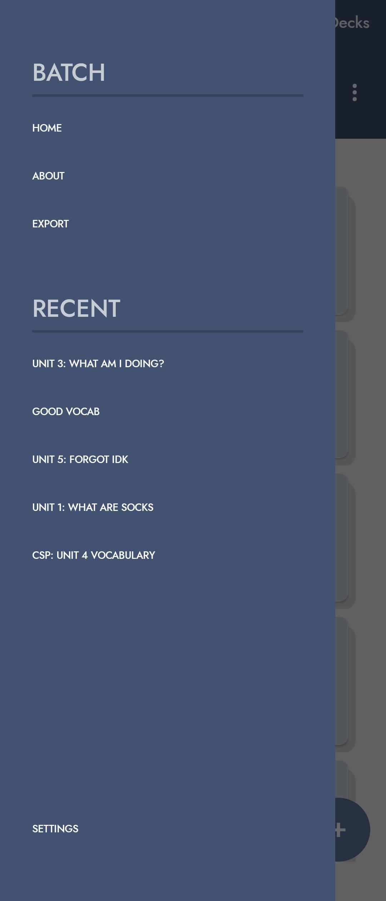
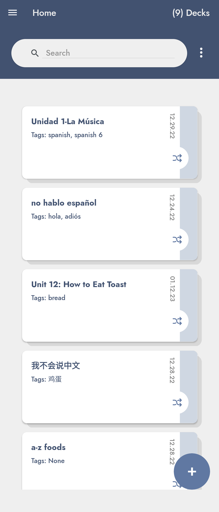
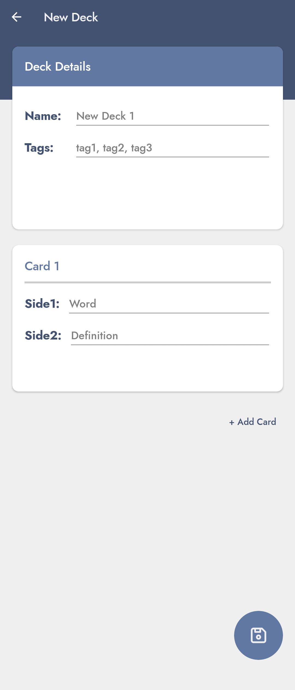
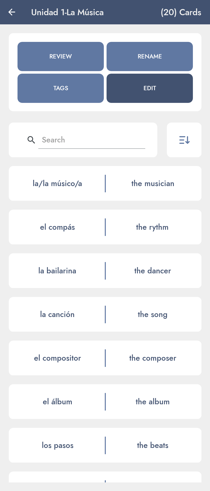
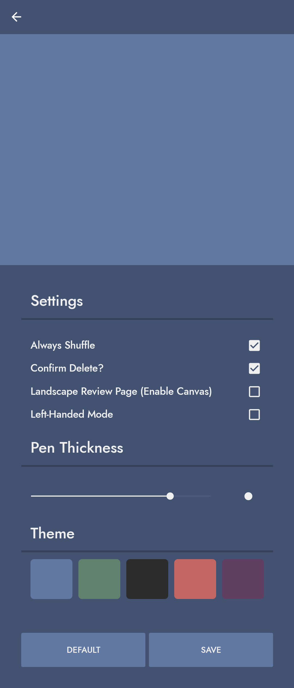

# Batch: Flashcard App for Android 

Missing ~~some~~ a lot of features but it runs at least. Supports a canvas for handwriting I guess...

Packages Used
----------

- [Xamarin.Forms](https://www.nuget.org/packages/Xamarin.Forms/5.0.0.2196)
- [TouchTracking.Forms](https://www.nuget.org/packages/TouchTracking.Forms/1.1.0)
- [SkiaSharp.Views.Forms](https://www.nuget.org/packages/SkiaSharp.Views.Forms/2.88.3)
- [System.Text.Json](https://www.nuget.org/packages/System.Text.Json/7.0.1)
  
Other Resources
----------

- Font: [Jost*](https://indestructibletype.com/Jost.html) by indestructiable type*
- Icons: [tabler-icons](https://github.com/tabler/tabler-icons)

Screenshots
----------

    
    
    
    
    

